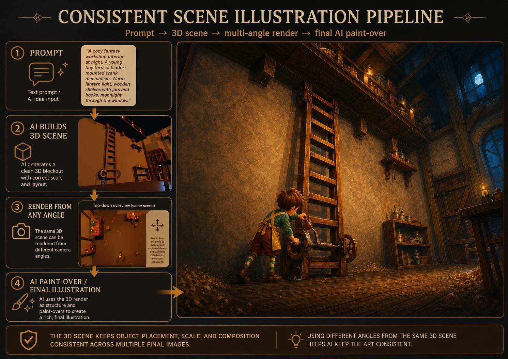
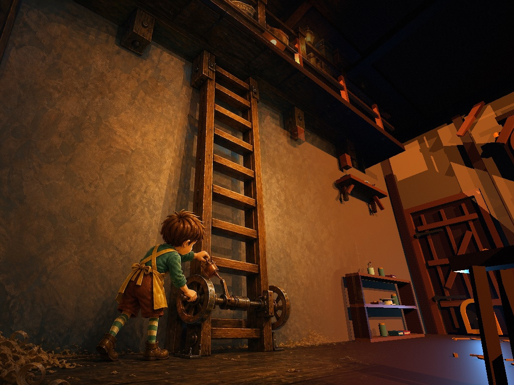
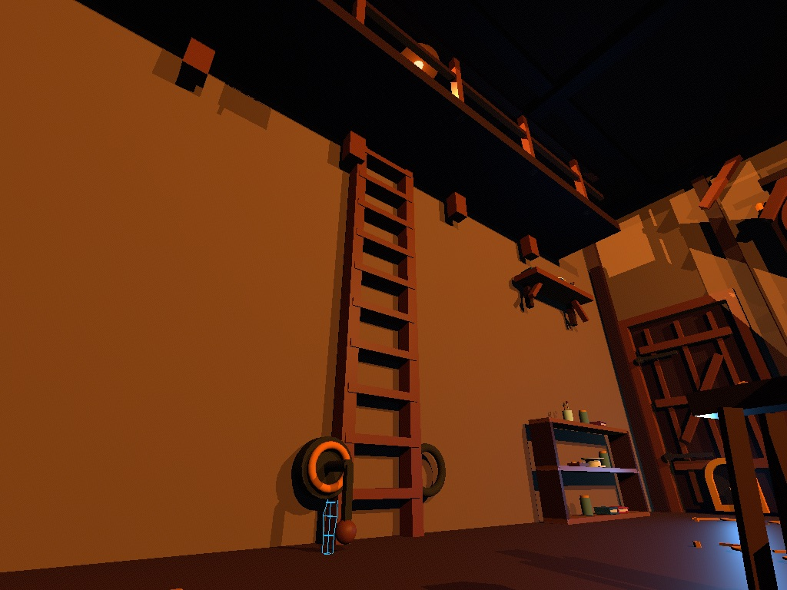
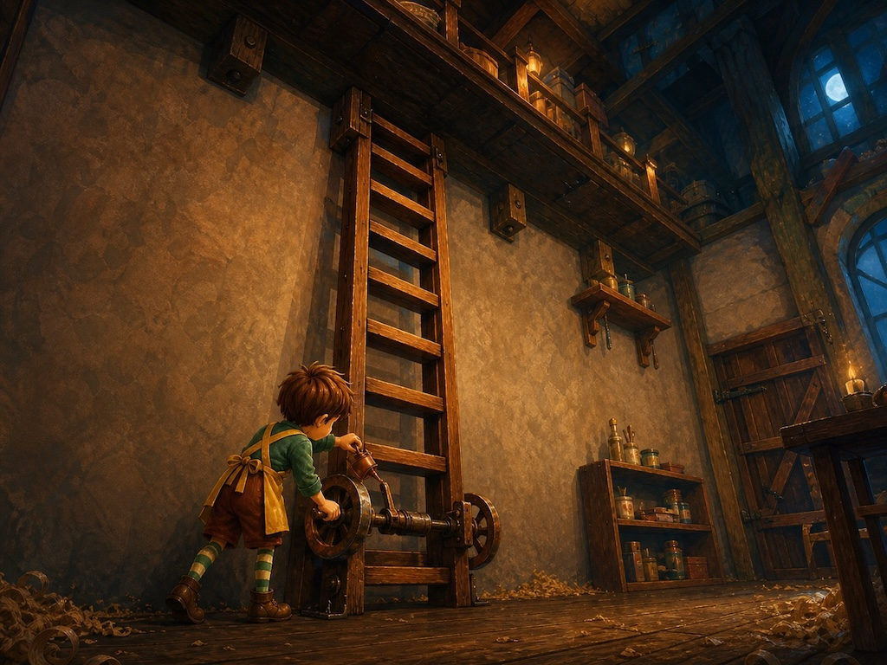

# Scener

A very small modular OpenGL scene renderer with real-time **stencil shadow
volumes**. Shadows are a first-class composition tool: position lights and
casters to create long silhouettes, pools of light, strong contrast, and
dramatic architectural shots. Scenes are described in XML and built from
walls, furniture, and basic primitives.

Scener is an Orion application. Its renderer is implemented by small C modules
with shared declarations in **`simplegl.h`**. Scene parsing has no external XML
or shader-file dependency; windowing, input, image output, and UI are provided
by Orion and its platform layer.

## Workflow



First, generate a 3D scene with AI via a prompt. Use SimpleGL to render it
from multiple cameras — the same lighting, shadows, and spatial relationships
stay consistent across every angle. Then feed those renders back to AI as
image-to-image references to draw over into final art. The 3D scene acts as a
**multi-view anchor** that keeps compositions, silhouettes, occlusions, and
lighting coherent when an illustration needs multiple shots of the same
location.

The [cinematic overpaint section](#from-scene-layout-to-cinematic-overpaint)
below walks through a concrete example using the Workshop scene.

## Build & run

```sh
make scener
./build/bin/scener apps/scener/scenes/sample_room.blks
```

Run these commands from the Orion repository root. Scener uses Orion's native
platform backend and OpenGL renderer on macOS, Linux, and Windows.

Install the executable, Orion runtime libraries, and assets under a standard
prefix with:

```sh
make install-scener PREFIX=/usr/local
```

`PREFIX` defaults to `/usr/local`; package recipes can also set `DESTDIR` to a
staging root. A dependent project should treat Scener as an external tool:

```make
SCENER ?= scener

.PHONY: check-scener render-scenes
check-scener:
  @command -v "$(SCENER)" >/dev/null || { \
    echo "scener is required"; exit 1; \
  }

render-scenes: check-scener
  $(SCENER) scenes/main.blks -cam Main -o build/main.jpg
```

This keeps Orion and its platform implementation private to the Scener
installation; downstream projects do not need either repository as a
submodule. A Homebrew formula can call the same target with `PREFIX=#{prefix}`.

**Controls:** mouse looks around, `W A S D` move, `Q`/`E` move down/up,
`Shift` moves faster, and `Esc` quits. Press `1` for normal shadows, `4` for
lighting without shadows, or `5` for white wireframe. Keys `2` and `3` show
the shadow-volume diagnostics.

## Reusable prefab variation

Prefab instances support complete `pos`, `rot`, `scale`, and `pivotOffset`
transforms. Their named attach points follow the same transform. A prefab may
mark selected child shapes with `tint="1"`; `color` on an instance then
replaces only those shapes' diffuse color while preserving their material
shininess and leaving unmarked parts unchanged.

```xml
<!-- The book prefab marks covers tintable, but not its paper page block. -->
<prefab source="items/book" color="0.58 0.08 0.06"/>
<prefab source="items/book" pos="0.5 0 0" color="0.08 0.22 0.56"/>
```

Important authoring features still missing are named multi-color material
slots, per-camera visibility or state variants, animation, object/layer names
for CLI inspection, orthographic and aspect-safe cameras, textures and alpha,
and area lights or soft shadows. Prefab-wide `material`, `shininess`,
`castShadow`, and `renderable` inheritance are also not implemented; child
shapes continue to own those properties.

## Rendering modes

Normal rendering uses every light's `castShadows` setting and produces the
full stencil-shadow result:

```sh
./build/bin/scener apps/scener/scenes/sample_room.blks
```

Render with the same materials and lighting but disable all shadows:

```sh
./build/bin/scener apps/scener/scenes/sample_room.blks -no-shadows -o shot.jpg
```

Render scene geometry as an unlit white wireframe:

```sh
./build/bin/scener apps/scener/scenes/sample_room.blks -wireframe -o wireframe.jpg
```

The same executable renders offscreen when an output path is supplied. JPEG is
the default when no path is supplied; `.jpg`, `.jpeg`, and `.png` paths select
the corresponding encoder:

```sh
./build/bin/scener apps/scener/scenes/sample_room.blks -cam Main -o shot.jpg
./build/bin/scener apps/scener/scenes/sample_room.blks -cam Main -no-shadows -o shot-no-shadows.jpg
./build/bin/scener apps/scener/scenes/sample_room.blks -cam Main -wireframe -o shot-wireframe.png
```

## From scene layout to cinematic overpaint

[`scenes/books/wondertown/workshop.blks`](scenes/books/wondertown/workshop.blks)
is a fully dressed toymaker's workshop assembled from reusable prefabs and
simple primitives. A monumental desk with carved legs dominates the back wall;
a stocked commode and ornate cuckoo clock hang beside a moonlit window. On the
opposite side, a workbench bristles with tools, books, jars, and curios, while
a wooden ladder climbs to a loft stacked with crates. Sawdust scatters the
floorboards. A single blue lamp and a cold moonbeam through the door flap
provide dramatic low-key lighting that pushes long shadows across every
surface.



Eleven named cameras follow Pip — a thumb-scale toymaker figure — through every
story beat: entering through the moonlit door, discovering clues on the
commode, crouching under the desk toward a copper oil can, climbing the
workbench leg, and traversing the ladder into the loft. Each camera reuses the
same geometry, materials, and lights, so spatial relationships lock regardless
of framing.

The comparisons below use the untouched SimpleGL output as an image-to-image
guide for an AI overpaint. Material detail and atmosphere are added, but the
camera, silhouettes, object placement, occlusion, lighting direction, and
major cast-shadow shapes are constrained by the source render.

| SimpleGL camera render | AI overpaint |
|---|---|
|  |  |
| `LadderTraversal` — Pip works the rusty winch from the ladder, framed through a wide vertical composition | Lighting, silhouette, and spatial cues from the 3D render anchor the overpaint. |

Reproduce any camera in the scene with:

```sh
./build/bin/scener apps/scener/scenes/books/wondertown/workshop.blks -cam LadderTraversal -o shot.jpg
```

## Why these choices

- **Core-profile GL with explicit vertex buffers.** Meshes, overlays, gizmos,
  and homogeneous stencil-shadow volumes use dedicated VAOs/VBOs and GLSL
  programs, so the renderer does not depend on compatibility-only immediate
  mode calls.
- **Own tiny XML parser**, not tinyxml/libxml. Pulling in libxml2 means
  linking a large C library (and its dependency chain) for a schema that's
  really just `<tag attr="val">`. tinyxml2 is closer to reasonable, but it's
  C++ and still an extra file/dependency to vendor. The recursive-descent C
  parser covers the schema below without another runtime dependency. If your
  scenes get much more complex you'd
  want to swap in a real parser — the loader code is isolated in
  `xml_parse()`/`load_scene()` so that's a contained change.
- **Booleans via boxes**, not real CSG. A proper solid-boolean library (BSP
  clipping, etc.) is a lot of code for what a room generator actually needs:
  rectangular holes in axis-aligned walls. So `<wall>` + `<opening>` doesn't
  do a boolean subtraction at all — it slices the wall's length into
  segments at each opening's edges and emits a handful of `<box>` objects:
  full-height boxes between openings, and a sill box + lintel box for each
  opening. See `build_wall_boxes()`. This is exactly "if forced to use boxes
  for booleans, so be it" — and it's enough for door/window frames, which is
  the actual use case. If you later need e.g. a circular hole or a boolean
  between two arbitrary meshes, that's a genuinely different (and much
  bigger) piece of code — worth doing as a separate module, not bolted on
  here.
- **Static scene ⇒ shadow volumes precomputed once.** Nothing in the scene
  format can move, so silhouette/volume computation happens once at load
  (`scene_build_all_shadow_volumes`), not per frame. If you add moving
  lights or objects later, call `build_shadow_volume()` again per-frame for
  whatever changed — the function is already factored out for that; only
  `main()`'s "compute once" call site needs to move into the render loop.

## Shadow algorithm

Classic robust **z-fail (Carmack's Reverse)** stencil shadow volumes, one
point light per pass:

The side-only, infinitely extruded Z-pass implementation is available with
`make zpass`, `make run-zpass`, and `make test-zpass`. These targets compile
with `USE_ZPASS` and write separate `*-zpass` binaries under `build/bin`.

1. **Ambient pass** – draw everything flat-shaded at `ambient * color`, with
   depth writes on. This seeds the depth buffer and the base (unlit) look.
2. For each shadow-casting light:
   a. **Stencil pass** – draw the light's closed shadow volume (silhouette
      side quads + light/dark caps) with color writes off, depth writes off,
      `glStencilOpSeparate`: back faces `INCR_WRAP` / front faces
      `DECR_WRAP` on depth-fail. This is the part that's still correct even
      when the camera itself is inside a shadow.
      Extruded vertices use homogeneous directions (`w=0`), and depth clamp
      prevents near/far clipping. If depth clamp is unavailable, stencil
      shadows are disabled and the lights render without shadows.
   b. **Lit pass** – redraw the scene fully lit (diffuse+specular, ambient
      zeroed to avoid double-counting), additively blended (`GL_ONE,
      GL_ONE`), only where the stencil value is `0` (i.e. *not* in shadow).
3. Non-shadow-casting lights just get an unconditional additive lit pass, no
   stencil test.

Silhouette detection needs a *flat* face normal per triangle
(`Mesh.triN`, computed straight from triangle vertex positions) — this is
kept separate from the shading normal (`Vertex.nrm`, smooth for
sphere/torus, per-facet for box/prism/cone) so the shadow math never cares
how a mesh happens to be shaded.

## XML scene authoring

Scene construction, placement conventions, prefab rules, the complete XML
schema, and required CLI validation live in the
[`populate-simplegl-scenes`](skills/populate-simplegl-scenes/SKILL.md) skill.
Use that skill whenever creating or changing scene and prefab XML files.

## Known limitations (all fixable, kept out on purpose for scope)

- One shadow-casting point light is exercised in the sample and is what the
  algorithm is written for; multiple lights work (the render loop already
  iterates `<light>` entries) but cost is O(lights × objects) shadow-volume
  triangles per frame relatively fast since they're precomputed once.
- Non-uniform scale (`scale="1 1 3"` on a rotated object) will slightly
  distort shading normals — normals use the rotation part of the transform
  only, not a full inverse-transpose. Fine for boxes/furniture; would matter
  for a heavily stretched sphere.
- No texturing — flat/vertex colors only.
- `<wall>` openings are axis-aligned rectangles only (that's the whole
  "boxes instead of real CSG" trade-off described above).
