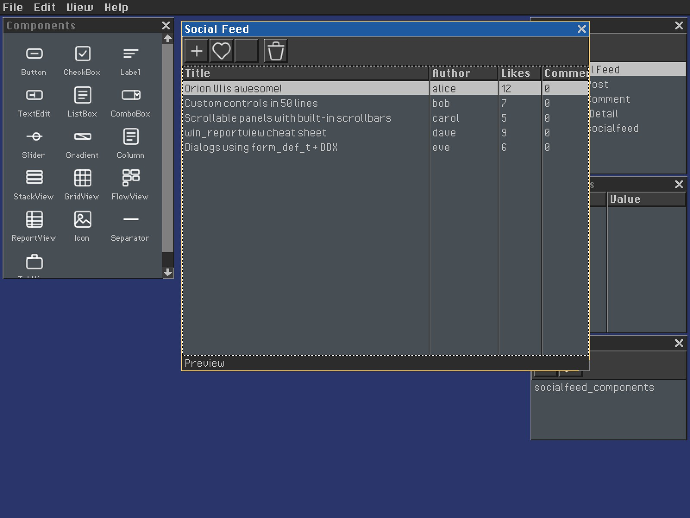

# Orion UI Framework



Orion is a standalone C11 UI framework for desktop applications and tools. It
uses WinAPI-style windows, messages, commands, and controls with snake_case
APIs, native [Platform](https://github.com/corepunch/platform) backends, and
hardware-accelerated rendering.

The framework includes:

- Windows, nested input routing, message queues, accelerators, and dialogs
- Reusable controls, auto-layout containers, menus, toolbars, and scrollbars
- Declarative `.orion` resources compiled into typed C definitions
- Database-bound forms and table views
- Standalone applications and loadable GEM modules from the same source
- Native macOS, Linux, and Windows support
- JPEG screenshot capture for documentation and automated presentation

## Quick Start

```bash
git clone https://github.com/corepunch/orion-ui.git
cd orion-ui
git submodule update --init --recursive
make apps
make test
```

Build individual programs or loadable modules:

```bash
make build/bin/helloworld
make build/bin/shell
make build/gem/helloworld.gem

build/bin/helloworld
build/bin/shell
```

Build the framework libraries with `make library`, or install the complete
suite under `/opt/orion` with `make install`.

## First Application

Applications expose a `gem_init` entry point and use the standard launcher to
produce both a standalone executable and a loadable GEM:

```c
#include <orion/ui.h>
#include <orion/gem.h>

static window_t *g_main_win;

static result_t main_proc(window_t *win, uint32_t msg,
                          uint32_t wparam, void *lparam) {
  switch (msg) {
    case evCreate: return true;
    case evPaint:
      draw_text_small("Hello from Orion", 16, 16, get_sys_color(brTextNormal));
      return true;
    case evDestroy:
      if (win == g_main_win) ui_request_quit();
      return true;
    default: return false;
  }
}

static bool gem_init(int argc, char **argv, hinstance_t hinstance) {
  (void)argc;
  (void)argv;
  g_main_win = create_window("Hello", 0, MAKERECT(40, 40, 320, 180),
                             NULL, main_proc, hinstance, NULL);
  return g_main_win != NULL;
}

static void gem_shutdown(void) {
  if (g_main_win) destroy_window(g_main_win);
  g_main_win = NULL;
}

GEM_DEFINE("Hello", "1.0", gem_init, gem_shutdown, NULL)
GEM_STANDALONE_MAIN("Hello", UI_INIT_DESKTOP, 640, 480, NULL, NULL)
```

See [Getting Started](docs/getting-started.md) for the complete source and build
setup, including declarative forms and SDK compiler flags.

## Architecture

```text
apps/          Applications, resources, components, and app-specific tests
orion/user/    Windows, messages, input, drawing, forms, and resources
orion/kernel/  Runtime services, graphics lifecycle, and rendering
orion/commctl/ Reusable controls and layout containers
orion/commdlg/ Modal dialogs and common pickers
platform/      Native windows, events, filesystems, processes, and networking
share/         Framework fonts, icons, shaders, and deployable assets
tests/         Framework behavior and integration tests
tools/         Resource compilers, generators, and release utilities
```

Platform events become Orion messages. Window procedures handle lifecycle and
input, controls notify their root with `evCommand`, controllers mutate
application state, and invalidated windows draw during `evPaint`.

Read [Architecture](ARCHITECTURE.md) for layer ownership, coordinate spaces,
message flow, resource compilation, application boundaries, and debugging.

## Declarative Resources

`.orion` XML is the canonical source for forms, menus, toolbars, accelerators,
and database metadata. `orionc` compiles it into typed C headers during the
build. Database forms identify resources with full paths such as
`field="db.authors.name"`; after registering `db`, the form resolves and saves
records without receiving a database pointer from its caller.

```c
show_db_dialog(&myapp_edit_author_form, "Edit Author", parent, author_id);
```

See [Database Forms](docs/database-forms.md) and
[Dialogs & DDX](docs/dialogs.md).

## Applications

The bundled apps are usable programs and architectural references:

- **Form Editor**: declarative UI authoring, plugins, inspectors, and live views
- **Image Editor**: MDI, canvas rendering, tools, layers, palettes, and animation
- **Git Client**: tabs, report views, staging, history, GitHub data, and diffs
- **Social Feed**: database-bound forms, tables, and MVC boundaries
- **Task Manager**: project data, commands, table views, and dialogs
- **Vibe Office**: desktop-style custom controls and process-backed state
- **Scener**: scene editing plus headless and CLI rendering

Browse screenshots and learning notes in the
[Application Gallery](docs/examples.md). App contributors should also read
[apps/README.md](apps/README.md).

## Screenshots

Press F12 for an interactive JPEG capture. Standalone apps using
`GEM_STANDALONE_MAIN` can capture the first fully painted frame and exit:

```bash
build/bin/imageeditor images/logo.png \
  --screenshot docs/screenshots/imageeditor_orion.jpg
```

See [Presenting an Application](docs/app-presentation.md) for screenshot and app
documentation standards.

## Documentation

- [Getting Started](docs/getting-started.md)
- [Architecture](ARCHITECTURE.md)
- [Window System](docs/window-system.md)
- [Controls](docs/controls.md)
- [Dialogs & DDX](docs/dialogs.md)
- [Messages & Events](docs/messages.md)
- [Drawing & Rendering](docs/drawing.md)
- [GEM Plugin System](docs/gems.md)
- [Package Manager](packaging/README.md)

The documentation site is published with GitHub Pages from `docs/`.
