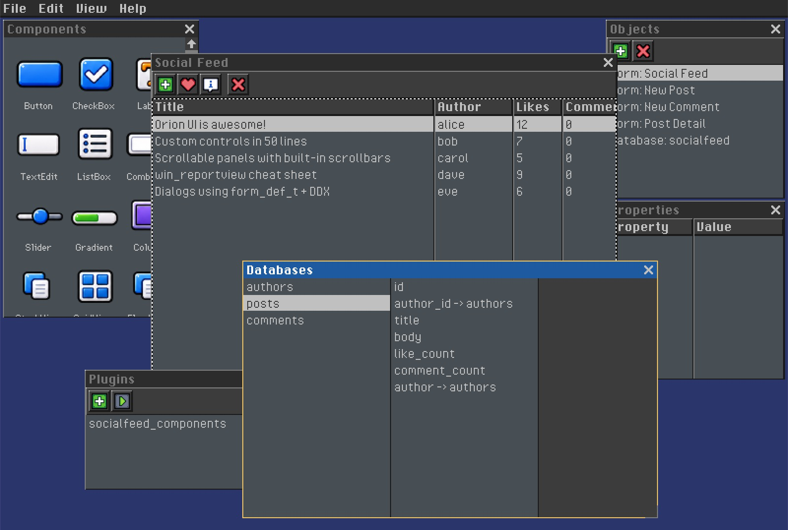
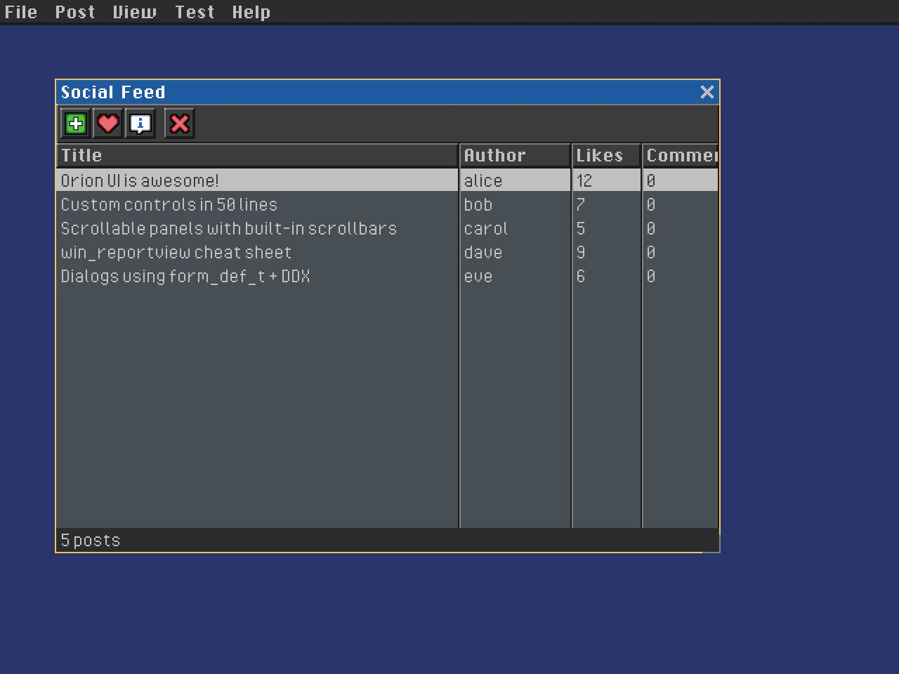

# Orion UI Framework


*Form editor with socialfeed project, component palette, and database bindings*

---

Orion is a retro-styled UI framework written in C that brings the familiar Windows API message-based architecture to modern cross-platform development. Extracted from DOOM-ED, it features a clean three-layer design modeled after classic Windows DLLs (USER, KERNEL, COMCTL), making it instantly recognizable to developers who have worked with Win32. Built on the [corepunch/platform](https://github.com/corepunch/platform) layer and OpenGL 3.2+, Orion delivers hardware-accelerated rendering with a nostalgic bitmap font aesthetic reminiscent of DOS and early Windows interfaces. The framework provides a complete set of common controls (buttons, checkboxes, edit boxes, lists, combo boxes, and a console) all following message-driven patterns that feel both vintage and powerful. Perfect for game tools, retro-style applications, or anyone who misses the simplicity and directness of classic GUI programming.


*Orion Shell loading multiple .gem applications -- a windowing system where apps run as sub-processes, similar to how Windows itself began as a GUI shell for DOS programs*

Orion applications compile to `.gem` shared libraries that are loaded and managed by the Orion Shell -- much like how early Windows served as a graphical shell for launching EXE programs. Each `.gem` runs in-process with its own `hinstance`, message loop, and window hierarchy, yet they coexist in a single desktop with unified focus and z-order. This architecture enables a modular design pattern: you can split a large application into independent sub-programs that communicate through the framework's message system. For example, a strategy game could structure its city view, world map, and diplomacy screens as separate `.gem` modules -- each self-contained, renderable, and independently testable -- all talking to a shared game kernel through the same message-passing API that drives the UI.

---

## Zero-Boilerplate Database Forms

Generate complete CRUD dialogs from XML with **ZERO** manual binding code.

**Traditional approach (200+ lines per table):**
```c
// Fetch record manually
author_t *record = fetch_author(db, id);

// Populate 20 fields one by one
set_window_item_text(dlg, ID_NAME, record->name);
set_window_item_text(dlg, ID_EMAIL, record->email);
// ... 18 more fields ...

// Extract values back out
get_window_item_text(dlg, ID_NAME, record->name, sizeof(record->name));
get_window_item_text(dlg, ID_EMAIL, record->email, sizeof(record->email));
// ... 18 more fields ...

// Build SQL and save
sprintf(sql, "UPDATE authors SET name='%s', email='%s' WHERE id=%d", ...);
// Error handling, memory management, etc.
```

**Orion approach (1 function call):**
```xml
<!-- Define once in your .orion file -->
<form name="edit_author" width="300" height="100">
  <textedit field="db.authors.name" />
  <textedit field="db.authors.email" />
  <button value="1" text="OK" />
</form>
```

```c
// Use it everywhere -- auto-fetch, auto-populate, auto-save
show_db_dialog(&form, "Edit Author", parent, db, author_id);
```

**What you get automatically:**
- Type-safe bindings with `offsetof()`/`sizeof()`
- Auto-fetch record from database
- Auto-populate all controls
- Auto-save on OK (INSERT or UPDATE)
- Compile-time field validation
- Multi-database support
- Zero boilerplate code

**Code reduction: 95%** (200 lines to 10 lines)


*Social feed application with database-driven posts, authors, and comments*

**[Read the complete Database Forms guide](docs/database-forms.md)**

---

## Screenshots

Press **F12** at any time to save a JPEG screenshot of the current application window to the user's settings directory. The filename includes a timestamp: `screenshot_YYYYMMDD_HHMMSS.jpg`.

Programmatic capture is available through the public API:

```c
// Save a JPEG screenshot to a specific path
bool ui_save_screenshot_jpg(const char *path, int quality);

// Low-level framebuffer capture into an RGBA buffer
bool capture_framebuffer_rgba(int w, int h, uint8_t *out_rgba);

// Save raw RGBA pixels to JPEG
bool save_image_jpg(const char *path, const uint8_t *pixels, int w, int h, int quality);
```

---

## Architecture

Orion follows a layered architecture similar to Windows:

### ui/user/ -- Window Management Layer
Handles window creation, destruction, message passing, and basic rendering primitives.

**Key Components:**
- Window structure (`window_t`)
- Window creation and lifecycle management
- Message queue and dispatch
- Drawing primitives (rectangles, text, icons)
- Window messages (evCreate, evPaint, evLeftButtonUp, etc.)

### ui/kernel/ -- Event Management Layer
Manages the platform (corepunch/platform) event loop and translates platform events into window messages. Also provides the Renderer API for OpenGL abstraction.

**Key Components:**
- Platform initialization (axInit)
- Event loop (`get_message`, `dispatch_message`)
- Global state (screen dimensions, running flag)
- **Renderer API**: High-level OpenGL abstraction (`R_Mesh`, `R_Texture`, `R_MeshDrawDynamic`)
  - See [docs/RENDERER_API.md](docs/RENDERER_API.md) for detailed documentation

### ui/commctl/ -- Common Controls Layer
Implements standard UI controls that can be used to build interfaces.

**Available Controls:**
- **Button**: Clickable button with text label
- **Checkbox**: Toggle control with checkmark
- **Edit**: Single-line text input control
- **Label**: Static text display
- **List**: Scrollable list of items
- **Combobox**: Dropdown selection control
- **Console**: Message display console with automatic fading and scrolling
- **ColumnView**: Multi-column item view with icons, colors, and double-click support
- **Terminal**: Interactive Lua script terminal with input/output (process finishes like Windows CMD)

## Building

Orion supports Linux, macOS, and Windows platforms.

### Dependencies

**Linux (Ubuntu/Debian):**
```bash
git submodule update --init
sudo apt-get install liblua5.4-dev libgl-dev libegl-dev libx11-dev
```

**macOS:**
```bash
brew install sdl2 lua
```

**Windows (MSYS2/MinGW64):**
```bash
pacman -S mingw-w64-x86_64-gcc mingw-w64-x86_64-make mingw-w64-x86_64-lua make
```

### Build Commands

```bash
# Build library (static and shared)
make library

# Build examples
make examples

# Build and run tests
make test

# Clean build artifacts
make clean
```

### Build Output

- **Linux**: `build/lib/liborion.a`, `build/lib/liborion.so`
- **macOS**: `build/lib/liborion.a`, `build/lib/liborion.dylib`
- **Windows**: `build/lib/liborion.a`, `build/lib/liborion.dll`
- **Examples/Tests**: `build/bin/`

## Usage

Include the main header in your code:

```c
#include "ui/ui.h"
```

Or include specific subsystems:

```c
#include "ui/user/user.h"
#include "ui/commctl/commctl.h"
```

### Creating a Window

```c
irect16_t frame = {100, 100, 200, 150};
window_t *win = create_window("My Window", 0, &frame, NULL, my_window_proc, NULL);
show_window(win, true);
```

### Creating Controls

```c
// Create a button
window_t *btn = create_window("Click Me", 0, &btn_frame, parent, win_button, NULL);

// Create a checkbox
window_t *chk = create_window("Enable Feature", 0, &chk_frame, parent, win_checkbox, NULL);

// Create an edit box
window_t *edit = create_window("Enter text", 0, &edit_frame, parent, win_textedit, NULL);

// Create a console window
window_t *console = create_window("Console", 0, &console_frame, parent, win_console, NULL);

// Create a columnview
window_t *columnview = create_window("", WINDOW_NOTITLE | WINDOW_TRANSPARENT, &cv_frame, parent, win_reportview, NULL);
```

### Async HTTP/HTTPS

Orion includes a message-driven async HTTP client in the kernel layer.
Requests run on a worker thread and report back to your window procedure.

```c
#include "ui.h"

typedef struct {
  http_request_id_t request_id;
} app_state_t;

static result_t win_main(window_t *win, uint32_t msg,
                         uint32_t wparam, void *lparam) {
  app_state_t *st = (app_state_t *)win->userdata;

  switch (msg) {
    case evCreate:
      st = calloc(1, sizeof(*st));
      win->userdata = st;
      st->request_id = http_request_async(win,
                                          "https://httpbin.org/get",
                                          NULL, NULL);
      return true;

    case evHttpProgress: {
      http_progress_t *p = (http_progress_t *)lparam;
      // p is framework-owned; valid only for this handler call.
      printf("request %u: %zu/%zd bytes\n",
             p->request_id, p->bytes_received, p->bytes_total);
      return true;
    }

    case evHttpDone: {
      http_response_t *resp = (http_response_t *)lparam;
      if (resp && resp->status == 200) {
        printf("HTTP %d, body bytes: %zu\n", resp->status, resp->body_len);
      } else if (resp && resp->error) {
        printf("HTTP error: %s\n", resp->error);
      }
      http_response_free(resp);
      return true;
    }

    case evDestroy:
      free(st);
      win->userdata = NULL;
      return true;
  }
  return false;
}
```

POST with custom headers:

```c
http_options_t opts = {
  .method  = HTTP_POST,
  .body    = "{\"name\":\"Orion\"}",
  .headers = "Content-Type: application/json\r\n",
};

http_request_id_t id = http_request_async(win,
                                          "https://api.example.com/items",
                                          &opts, NULL);
```

Cancel a request:

```c
http_cancel(id);
```

Full reference and limitations: [docs/http.md](docs/http.md)

### Declarative Forms (create_window_from_form / show_dialog_from_form)

Dialogs and panels with multiple standard controls should be described using
`form_def_t` and `form_ctrl_def_t` rather than imperatively calling
`create_window()` inside `evCreate`.  This mirrors the WinAPI
`DLGTEMPLATE` / `CreateDialogIndirect` pattern.

```c
#include "ui.h"

// Define children (socialfeed-style auto layout)
static const form_ctrl_def_t kMyDialogChildren[] = {
  {
    .class_name = "stack",
    .name = "name_row",
    .flags = WINDOW_STACK_HORIZONTAL,
    .layout_spacing = 6,
    .h_align = LAYOUT_ALIGN_STRETCH,
    .children = (const form_ctrl_def_t[]){
      { .class_name = "label", .text = "Name:", .name = "lbl_name", .size = {56, 13} },
      { .class_name = "textedit", .id = 1, .text = "", .name = "name",
        .flags = WINDOW_FLEXSPACE, .h_align = LAYOUT_ALIGN_STRETCH },
    },
    .child_count = 2,
  },
  {
    .class_name = "stack",
    .name = "actions",
    .flags = WINDOW_STACK_HORIZONTAL,
    .layout_spacing = 6,
    .h_align = LAYOUT_ALIGN_STRETCH,
    .children = (const form_ctrl_def_t[]){
      { .class_name = "space", .name = "flex", .h_align = LAYOUT_ALIGN_STRETCH },
      { .class_name = "button", .id = 2, .size = {40, 13}, .flags = BUTTON_DEFAULT, .text = "OK", .name = "ok" },
      { .class_name = "button", .id = 3, .size = {50, 13}, .text = "Cancel", .name = "cancel" },
    },
    .child_count = 3,
  },
};

// Define the form
static const form_def_t kMyDialogForm = {
  .name        = "My Dialog",
  .width       = 160,
  .height      = 52,
  .flags       = WINDOW_AUTO_LAYOUT,
  .layout_spacing = 6,
  .padding     = {8, 8, 8, 8},
  .children    = kMyDialogChildren,
  .child_count = ARRAY_LEN(kMyDialogChildren),
};

// Window procedure
// Children already exist when evCreate fires.
static result_t my_dlg_proc(window_t *win, uint32_t msg,
                             uint32_t wparam, void *lparam) {
  switch (msg) {
    case evCreate:
      // lparam is the caller-supplied state, NOT used to create children here.
      win->userdata = lparam;
      // Set initial text / values from state:
      set_window_item_text(win, 1, "default");
      return true;

    case evPaint:
      draw_text_small("Name:", 4, 11, get_sys_color(brTextDisabled));
      return false;

    case evCommand:
      if (HIWORD(wparam) == btnClicked) {
        window_t *src = (window_t *)lparam;
        if (src->id == 2) { end_dialog(win, 1); return true; }
        if (src->id == 3) { end_dialog(win, 0); return true; }
      }
      return false;

    default: return false;
  }
}

// Show as a modal dialog
// show_dialog_from_form() centers the window, adds WINDOW_DIALOG flags,
// and runs the modal loop -- no position/size arithmetic needed.
void show_my_dialog(window_t *parent) {
  my_state_t st = { ... };
  show_dialog_from_form(&kMyDialogForm, "My Dialog", parent, my_dlg_proc, &st);
}

// Or instantiate as a modeless window
void create_my_panel(window_t *parent, int x, int y) {
  create_window_from_form(&kMyDialogForm, x, y, parent, my_dlg_proc, NULL);
}
```

**Rules for form-based dialogs:**

- Always define a static `form_ctrl_def_t[]` + `form_def_t` for any dialog with
  two or more standard controls.
- Follow the `examples/socialfeed/socialfeed.orion` pattern: describe the dialog
  as nested stack/grid rows and columns, using fixed `.size = {w, h}` hints only
  where a control needs a minimum width or height.
- Never create child controls imperatively inside `evCreate` when a
  `form_def_t` can express the same layout statically.
- Use `set_window_item_text(win, id, ...)` in `evCreate` to set
  runtime-determined initial values (edit box contents, etc.).
- Use `show_dialog_from_form()` for modal dialogs -- it handles centering, dialog
  flags, and the modal loop automatically.
- Use `create_window_from_form()` for modeless panels / embedded sub-forms.
- The form editor saves `.h` files that declare a compatible `form_def_t` struct
  (see `examples/formeditor/`).  Include those headers and pass the struct
  directly to `create_window_from_form()` or `show_dialog_from_form()`.

### Dialog Data Exchange (DDX)

To eliminate the boilerplate of reading and writing every dialog field
individually, Orion provides a declarative binding API analogous to MFC's DDX.
Declare a static `ctrl_binding_t[]` table and call `dialog_push()` on open and
`dialog_pull()` on accept:

```c
// Binding table -- one entry per control/field pair.
static const ctrl_binding_t k_bindings[] = {
  { ID_TITLE_EDIT,    BIND_STRING,    offsetof(my_state_t, title),    sizeof_field(my_state_t, title), 0 },
  { ID_PRIORITY_COMBO,BIND_INT_COMBO, offsetof(my_state_t, priority), 0, 0 },
  { ID_SIZE_EDIT,     BIND_INT,       offsetof(my_state_t, size),     0, 0 },
};

// evCreate -- push state into controls:
dialog_push(win, s, k_bindings, ARRAY_LEN(k_bindings));

// OK handler -- pull controls back into state:
dialog_pull(win, s, k_bindings, ARRAY_LEN(k_bindings));

// Command-driven pull (evCommand notifications):
// dialog_pull_command(win, s, k_bindings, ARRAY_LEN(k_bindings), HIWORD(wparam));
```

| `bind_type_t` | Control | State field |
|---|---|---|
| `BIND_STRING` | `FORM_CTRL_TEXTEDIT` | `char[]` -- `size` = `sizeof_field(...)` |
| `BIND_INT_COMBO` | `FORM_CTRL_COMBOBOX` | `int` -- selection index |
| `BIND_INT` | `FORM_CTRL_TEXTEDIT` | `int` -- decimal text |

See [Dialogs and DDX](docs/dialogs.md) for the full API reference.

### Using the ColumnView

```c
#include "ui/commctl/columnview.h"

// Create a columnview control
irect16_t cv_rect = {0, 0, 400, 300};
window_t *cv = create_window("", WINDOW_NOTITLE | WINDOW_TRANSPARENT, &cv_rect, parent, win_reportview, NULL);
show_window(cv, true);

// Add items to the columnview
reportview_item_t item;
strncpy(item.text, "Item 1", sizeof(item.text) - 1);
item.text[sizeof(item.text) - 1] = '\0';
item.icon = ICON_FOLDER;  // 8x8 icon index
item.color = COLOR_TEXT_NORMAL;  // RGBA color
item.userdata = my_data_ptr;  // Optional user data pointer
send_message(cv, RVM_ADDITEM, 0, &item);

// Set column width (optional, default is 160)
send_message(cv, RVM_SETCOLUMNWIDTH, 180, NULL);

// Handle notifications in parent window procedure
case evCommand: {
  uint16_t id = LOWORD(wparam);
  uint16_t code = HIWORD(wparam);
  
  if (id == cv->id) {
    if (code == RVN_SELCHANGE) {
      int index = (int)(intptr_t)lparam;
      // Selection changed to index
    } else if (code == RVN_DBLCLK) {
      int index = (int)(intptr_t)lparam;
      // Item at index was double-clicked
    }
  }
  break;
}

// Clear all items
send_message(cv, RVM_CLEAR, 0, NULL);

// Get item count
int count = send_message(cv, RVM_GETITEMCOUNT, 0, NULL);

// Get/set selection
int sel = send_message(cv, RVM_GETSELECTION, 0, NULL);
send_message(cv, RVM_SETSELECTION, new_index, NULL);
```

### Using the Console

```c
#include "ui/commctl/console.h"

// Initialize the console system (call once at startup)
init_console();

// Print messages to the console
conprintf("Game started");
conprintf("Player health: %d", player_health);

// Messages automatically fade after 5 seconds
// Draw the console overlay (called from your render loop or window procedure)
// draw_console() is called automatically by win_console in evPaint

// Toggle console visibility
toggle_console();

// Clean up (call at shutdown)
shutdown_console();
```

### Using the Terminal

The VGA terminal (`examples/terminal`) is a standalone app and GEM with
VGA-accelerated rendering, scrollback, ANSI parsing, and Lua scripting.

#### Standalone usage
```sh
terminal              # interactive command mode
terminal script.lua   # run a Lua script on startup
```

#### Launching from another GEM
```c
// Pass a script path via terminal_launch_t in create_window's lparam
terminal_launch_t launch = { .script_path = "/path/to/script.lua" };
window_t *terminal = create_window("Terminal", WINDOW_VSCROLL, &frame,
                                   parent, terminal_proc, hinstance, &launch);
show_window(terminal, true);
```

The terminal supports:
- VGA GPU font rendering with 16-color EGA palette
- 1000-line scrollback ring buffer with mouse wheel
- ANSI escape sequences (SGR, CUP, ED, EL)
- Built-in commands: `echo`, `help`, `clear`, `dir`/`ls`, `pwd`, `cd`, `cat`, `date`, `whoami`
- Lua scripting via `lua <script.lua>` or startup launch contract
- Interactive `io.read()` via coroutine yield/resume
- `.lua` file association when loaded as a GEM under the shell
- Paths with spaces (uses structured launch data, not command string)

## Window Messages

The framework uses a message-based architecture. Common messages include:

- `evCreate` -- Window is being created
- `evDestroy` -- Window is being destroyed
- `evPaint` -- Window needs to be redrawn
- `evLeftButtonDown` -- Left mouse button pressed
- `evLeftButtonUp` -- Left mouse button released
- `evKeyDown` -- Key pressed
- `evKeyUp` -- Key released
- `evCommand` -- Control notification

## Control-Specific Messages

### Button Messages
- `btnClicked` -- Button was clicked

### Checkbox Messages
- `btnSetCheck` -- Set checkbox state
- `btnGetCheck` -- Get checkbox state

### Combobox Messages
- `cbAddString` -- Add item to combobox
- `cbGetCurrentSelection` -- Get currently selected item
- `cbSetCurrentSelection` -- Set currently selected item
- `cbSelectionChange` -- Selection changed notification

### Edit Box Messages
- `edUpdate` -- Text was modified

### ColumnView Messages
- `RVM_ADDITEM` -- Add item with icon, color, text, and userdata
- `RVM_DELETEITEM` -- Remove item by index
- `RVM_GETITEMCOUNT` -- Get total item count
- `RVM_GETSELECTION` -- Get current selection index
- `RVM_SETSELECTION` -- Set selection by index
- `RVM_CLEAR` -- Clear all items
- `RVM_SETCOLUMNWIDTH` -- Set column width (default 160)
- `RVM_GETCOLUMNWIDTH` -- Get current column width
- `RVM_GETITEMDATA` -- Get item data by index
- `RVM_SETITEMDATA` -- Update item data
- `RVN_SELCHANGE` -- Selection changed notification
- `RVN_DBLCLK` -- Item double-clicked notification

## Built-in System Icons

Orion ships a PNG icon sheet whose source asset in the repository is
`share/icon_sheet_16x16.png`. At runtime, the deployed path is typically
`<exe_dir>/../share/orion/icon_sheet_16x16.png`, and it is loaded automatically
at `ui_init_graphics()` time.  The sheet is a 20x20 grid of 16x16 pixel RGBA
icons.  All icon names are defined as an enum in `user/icons.h`.

### Icon index base

Every `sysicon_*` value starts at `SYSICON_BASE` (`0x10000`).  When the
framework sees a toolbar-button icon value `>= SYSICON_BASE` it draws the icon
from the built-in sheet automatically -- no `tbLoadStrip` call is
required.

### Using sysicons in a WINDOW_TOOLBAR

```c
#include "user/icons.h"

static const toolbar_button_t kMyToolbar[] = {
  { sysicon_add,    ID_NEW,  0 },
  { sysicon_accept, ID_SAVE, 0 },
};
send_message(win, tbAddButtons,
             sizeof(kMyToolbar) / sizeof(kMyToolbar[0]),
             (void *)kMyToolbar);
```

The engine draws the correct icon from the sheet without any extra setup.

### Using sysicons in a standalone win_toolbar_button

For `win_toolbar_button` windows you pass the strip explicitly via
`btnSetImage`.  Use `ui_get_sysicon_strip()` to obtain the
pre-loaded strip and subtract `SYSICON_BASE` to get the strip-local index:

```c
bitmap_strip_t *strip = ui_get_sysicon_strip();
if (strip) {
  send_message(btn, btnSetImage,
               (uint32_t)(sysicon_add - SYSICON_BASE), strip);
}
```

### Available icons

All icons are listed in `user/icons.h` as `sysicon_<name>` enum values
(e.g., `sysicon_add`, `sysicon_accept`, `sysicon_folder`, `sysicon_save`,
`sysicon_world`, ...).  The enum contains approximately 398 entries covering common UI
actions, file types, and editor concepts.

### Asset deployment

The build system copies `share/icon_sheet_16x16.png` to
`build/share/orion/icon_sheet_16x16.png` as part of the `share` target
(which is a dependency of `examples`).  The framework resolves the path at
runtime relative to the running executable:
`<exe_dir>/../share/orion/icon_sheet_16x16.png`.

## Text Rendering API

Orion provides text rendering through `ui/user/text.h`:

### Small Bitmap Font (6x8 pixels)

```c
#include "ui/user/text.h"

// Initialize text rendering system (call once at startup)
init_text_rendering();

// Draw text with small bitmap font
draw_text_small("Hello World", x, y, 0xFFFFFFFF); // color as RGBA

// Measure text width
int width = strwidth("Hello World");
int partial_width = strnwidth("Hello", 5);

// Advanced text rendering with wrapping and scrolling
// Calculate text height with wrapping
int height = calc_text_height(text, window_width);

// Draw text with wrapping and viewport clipping
draw_text_wrapped(text, x, y, width, height, 0xFFFFFFFF);

// Clean up (call at shutdown)
shutdown_text_rendering();
```

### DOOM/Hexen Game Font

```c
// Load game font from WAD file (call after loading WAD)
load_console_font();

// Draw text with game font (includes fade-out effect)
draw_text_gl3("DOOM", x, y, 1.0f); // alpha 0.0-1.0

// Measure game font text width
int width = get_text_width("DOOM");
```

### Notes
- Small bitmap font supports all 128 ASCII characters
- DOOM/Hexen font supports characters 33-95 (printable ASCII)
- Font atlas is created automatically for efficient rendering
- Text rendering uses OpenGL for hardware acceleration
- `draw_text_wrapped()` automatically wraps text to fit within specified width
- `calc_text_height()` calculates total height needed for wrapped text
- Both functions handle text that exceeds viewport bounds efficiently


## Status

This is an in-progress refactoring. The framework currently:

- Has header files defining the API structure
- Has extracted common control implementations (button, checkbox, edit, label, list, combobox, console)
- Has extracted text rendering to `ui/user/text.c` (small bitmap font and DOOM/Hexen fonts)
- Has moved console to `ui/commctl/console.c` (console message management and display)
- Has integrated with build system (Makefile)
- Has comprehensive cleanup functions with no memory leaks
- Core window management code still needs to be moved from mapview/window.c
- Drawing primitives still need to be moved from mapview/sprites.c

## Memory Management

Orion has been verified to have proper cleanup with no memory leaks:

### Cleanup Functions
- `ui_shutdown_graphics()` -- Main cleanup function that:
  - Destroys all windows
  - Cleans up all window hooks
  - Shuts down joystick subsystem (if initialized)
  - Cleans up renderer resources (shaders, VAO, VBO)
  - Cleans up white texture
  - Cleans up console and text rendering
  - Destroys OpenGL context and platform window
  - Calls axShutdown()

All cleanup functions are idempotent and safe to call multiple times.

### Memory Leak Verification
Orion has been tested with Valgrind to ensure no memory leaks:
- **definitely lost: 0 bytes**
- **indirectly lost: 0 bytes**
- **possibly lost: 0 bytes**

To verify cleanup yourself:
```bash
# Build tests
make test

# Run with valgrind
valgrind --leak-check=full ./build/bin/test_memory_leak_test
valgrind --leak-check=full ./build/bin/test_integration_cleanup
```

## Recent Changes

### Screenshot Support (August 2026)
- **F12 global shortcut**: Press F12 in any Orion application to save a JPEG screenshot
- **`ui_save_screenshot_jpg()`**: Public API for programmatic screenshot capture
- **`capture_framebuffer_rgba()`**: Low-level framebuffer-to-RGBA pixel readback
- **`save_image_jpg()`**: JPEG encoding support via stb_image_write

### Cleanup and Memory Management (January 2026)
- **Comprehensive cleanup functions**: Added `cleanup_all_windows()` and `cleanup_all_hooks()`
- **Idempotent cleanup**: All cleanup functions now safe to call multiple times
- **Memory leak verification**: Verified with Valgrind - zero memory leaks
- **Resource cleanup**: Proper cleanup of OpenGL resources (textures, VAOs, VBOs, shaders)
- **State clearing**: All static state properly cleared on shutdown

### Text Rendering Module (ui/user/text.c, ui/user/text.h)
- **Small bitmap font rendering**: `draw_text_small()`, `strwidth()`, `strnwidth()`
- **DOOM/Hexen font rendering**: `draw_text_gl3()`, `get_text_width()`, `load_console_font()`
- **Font atlas management**: Automatic creation of font texture atlas for efficient rendering
- Extracted from mapview/windows/console.c to make text rendering reusable

### Console Module (ui/commctl/console.c, ui/commctl/console.h)
- **Console message management**: Circular buffer for console messages with timestamps
- **Message display**: Automatic fading and scrolling of recent messages
- **Public API**: `init_console()`, `conprintf()`, `draw_console()`, `shutdown_console()`, `toggle_console()`
- Uses text rendering module for display
- Moved from mapview/windows/console.c to UI framework

## Future Work

1. Move core window management functions to `ui/user/window.c`
2. Move message queue to `ui/user/message.c`
3. Move drawing primitives to `ui/user/draw.c`
4. Update Xcode project with new file locations
5. Add documentation for each function
6. Add example code
7. Add unit tests for UI components
