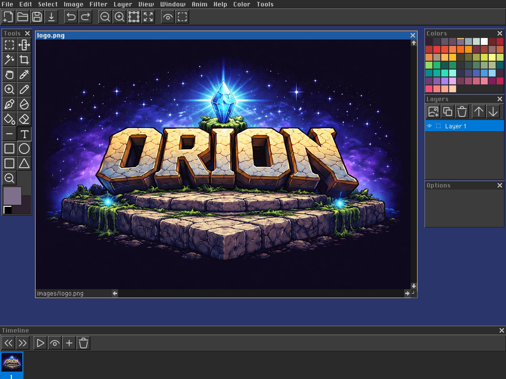
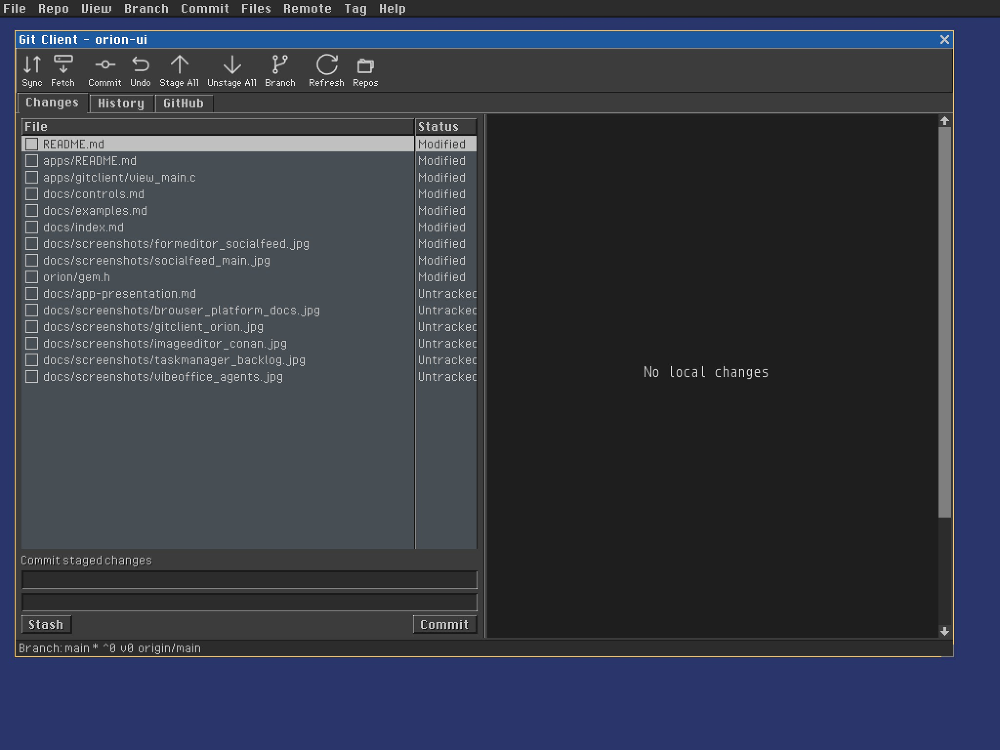
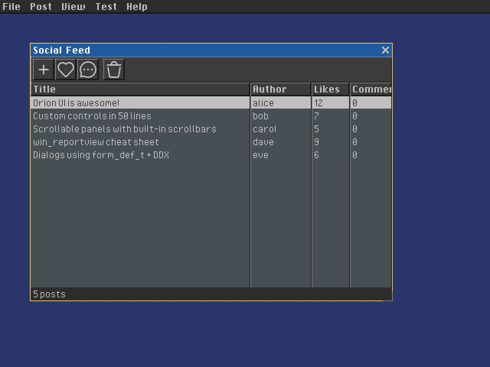
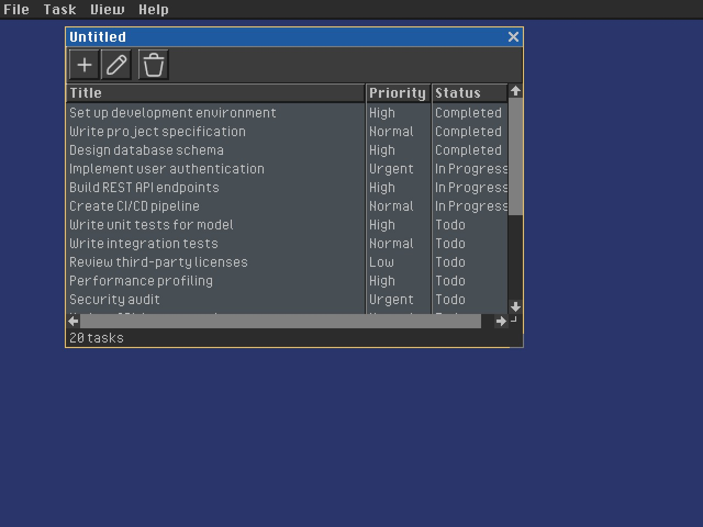
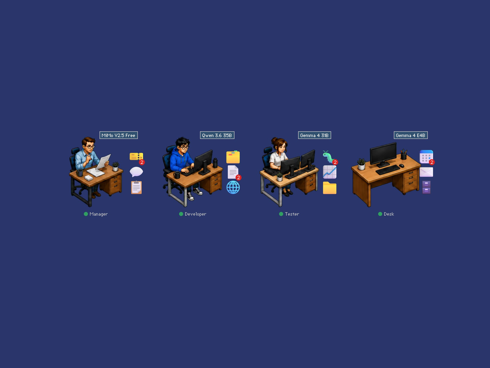

# Applications

Orion ships complete applications under `apps/`. They are useful programs as
well as reference implementations for messages, declarative forms, databases,
controls, native platform services, and loadable GEM modules.

Build the suite with `make apps`, or install released apps independently with
the [Orion Package Manager](package-manager/). See the
[Application Presentation Guide](app-presentation) when adding another app to
this gallery.

## Image Editor



A multi-document raster editor with drawing and selection tools, layers,
palettes, image filters, animation frames, onion skinning, and PNG/JPEG/BMP
I/O. It demonstrates MDI documents, toolbars, floating palettes, custom canvas
rendering, scrollbars, lists, and timeline controls.

```bash
orion install imageeditor
build/bin/imageeditor images/logo.png
```

## Git Client



A repository client with working-tree changes, staging, commit history,
branches, remotes, tags, stashes, GitHub issues and pull requests, and unified
or split diffs. It demonstrates tab views, report views, split views, toolbar
actions, status bars, database adaptors, and always-on interaction tracing.

```bash
orion install gitclient
build/bin/gitclient .
```

## Form Editor


A visual editor for declarative `.orion` projects. It combines a component
library, live design surface, forms browser, property inspector, database
bindings, plugin discovery, and project serialization.

```bash
orion install formeditor
build/bin/formeditor apps/socialfeed/socialfeed.orion
```

## Social Feed



A database-driven social application with authors, posts, comments, replies,
and generated edit forms. It demonstrates self-contained field bindings,
XML-backed data, report views, modal forms, and MVC application structure.

```bash
orion install socialfeed
build/bin/socialfeed
```

## Task Manager



A multi-document task tracker with priorities, status, due dates, editing,
filtering, and seeded project data. It demonstrates table views, menus,
toolbars, status bars, document commands, and an MVC split.

```bash
orion install taskmanager
build/bin/taskmanager
```

## Vibe Office



A desktop-style workspace for assigning work to coding agents and inspecting
status, models, messages, and generated artifacts. It demonstrates transparent
desktop children, draggable icon controls, image assets, forms, combo boxes,
and process-backed application state.

```bash
orion install vibeoffice
build/bin/vibeoffice
```

## Smaller References

- **Hello World** demonstrates the minimal window, label, button, message loop,
  painting, and command notification flow.
- **File Manager** demonstrates directory traversal, two-pane report views,
  selection, double-click navigation, and status text.
- **Terminal** demonstrates the optional Lua integration and console-style text
  interaction.
- **Browser** demonstrates HTTP and local HTML navigation, address editing,
  scrolling content, menus, and asynchronous completion messages.
- **Scener** demonstrates native OpenGL scene editing and deterministic
  multi-camera rendering. Its [complete guide](../apps/scener/README.md)
  documents scene and prefab authoring.

All substantial applications can also be built as loadable `.gem` modules with
`make gems` and run inside Orion Shell. See [Gem Plugin System](gems.md).
